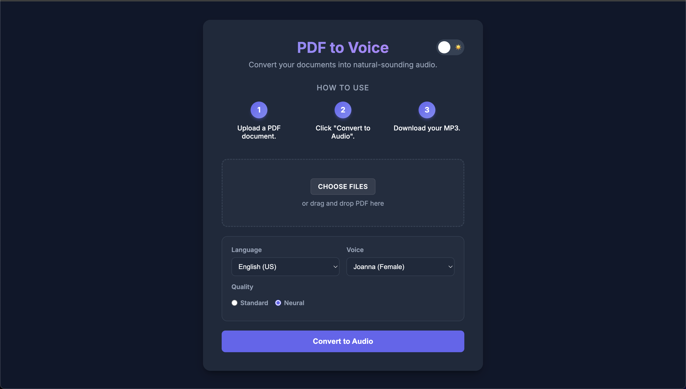

# 🎙️ PDF to Voice Converter (Polly Edition)

A high-performance Flask web application that converts long-form PDF documents (like books and research papers) into natural-sounding audio using AWS Polly.

 *<!-- You can add a screenshot here later -->

## 🌟 Key Features

*   **Intelligent Text Extraction**: Parses PDF documents to extract readable text while filtering out header/footer noise.
*   **Parallel Processing Engine**: Unlike standard converters that process text sequentially, this app chunks text and sends parallel requests to AWS Polly, significantly reducing conversion time for large books.
*   **Bilingual & Regional Voice Support**:
    *   **English (US, UK, AU, Indian)**
    *   **Hindi** (via bilingual Indian English neural voices)
    *   Automatic quality selection (Switching between **Neural** and **Standard** engines).
*   **Smart Chunking**: Splits text into semantic blocks to ensure natural pauses and intonation are preserved during speech synthesis.
*   **Modern UI/UX**:
    *   Dark/Light mode toggle.
    *   Real-time processing status updates.
    *   Integrated audio player.

## 🛠️ Architecture Overview

The application is built on a modular Service-Oriented Architecture (SOA) to ensure scalability:

1.  **Frontend**: HTML5/CSS3 with Vanilla JS for dynamic DOM manipulation (Voice selection, Theme extraction).
2.  **Backend (Flask)**:
    *   `app.py`: Handles routing and request validation.
    *   `services/pdf_service.py`: Handles file I/O and text cleaning.
    *   `services/tts_service.py`: The core engine. It manages the `concurrent.futures` thread pool to orchestrate AWS Polly synthesis and stitches the resulting audio streams into a single seamless MP3.
3.  **Infrastructure**: Powered by **AWS Polly** (Neural Engine) for best-in-class speech synthesis.

## 🚀 Getting Started

### Prerequisites
*   Python 3.8+
*   AWS Account with Polly access (IAM User with `AmazonPollyFullAccess`).

### Installation
1.  **Clone the repository**
    ```bash
    git clone https://github.com/yourusername/pdf-to-voice.git
    cd pdf-to-voice
    ```

2.  **Install Dependencies**
    ```bash
    pip install -r requirements.txt
    ```

3.  **Configure AWS Credentials**
    Ensure your environment variables are set (or use `aws configure`):
    ```bash
    export AWS_ACCESS_KEY_ID=your_key_id
    export AWS_SECRET_ACCESS_KEY=your_secret_key
    export AWS_DEFAULT_REGION=us-east-1
    ```

4.  **Run the Application**
    ```bash
    python3 app.py
    ```
    Visit `http://127.0.0.1:5000` in your browser.

## 🔒 Security Note
This project processes files locally effectively acting as a pass-through to AWS. No file content is permanently stored on the server side after processing is complete (temp files are cleaned up).

## 🔮 Future Roadmap
*   User Accounts & Cloud Storage for Audio History.
*   Mobile App Interface.
*   Support for ePub and Mobi formats.

---
*Built for the Modern Listener.*
